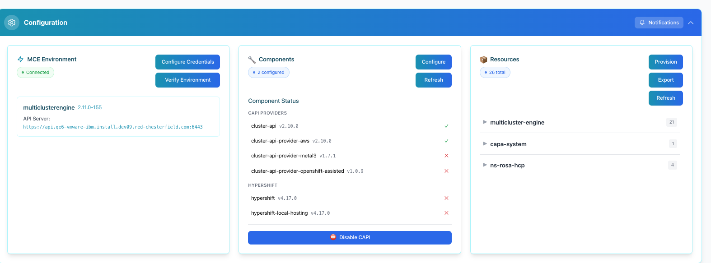
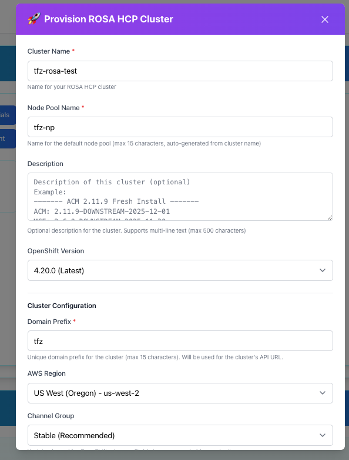
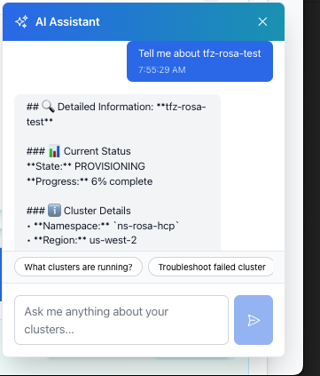

# CAPI Automation

Tired of juggling 10 terminal windows just to provision a ROSA cluster? Manually creating VPCs, subnets, and IAM roles for an hour before you can even start? Writing YAML and hoping you didn't typo an ARN?

CAPI Automation uses intelligent agents to handle all of that autonomously. Agents auto-generate your AWS infrastructure, validate configs before deployment, monitor progress in real-time, and an AI agent answers your questions in plain language - all working together while you watch.

Managing ROSA clusters used to mean:
- An hour of AWS infrastructure setup
- Running 20+ commands in the right order
- Guessing at valid configuration options
- Wrestling with YAML syntax
- Googling error messages for hours
- Manually checking status every 2 minutes

**CAPI Automation with autonomous agents makes it:**
- 🤖 **Agents handle the entire workflow** - click once, watch it happen
- ✨ **Infrastructure agent** auto-generates VPCs, roles, OIDC
- ✅ **Validation agent** ensures only valid options
- 🧠 **AI agent** validates configs and answers questions
- 📊 **Monitoring agent** tracks progress in real-time
- ⏱️ **Your time:** 2 minutes to click and configure
- ⏱️ **Agent time:** 28 minutes orchestrating everything

---

**Features:**

- 🤖 **Autonomous agents** handle complex workflows for you
- 🚀 Provision clusters in **minutes, not hours**
- 🧠 AI assistant that knows CAPI and ROSA
- 🌐 Auto-generate networks, roles, and OIDC
- ✅ Only see valid versions and options
- 🎯 Never accidentally deploy to the wrong environment
- 🎬 **Run Ansible playbooks directly from the UI** - No terminal needed
- 💬 **Embedded terminal with quick commands** - When you DO need CLI, it's right there
- 🎨 **Adapts to your role** - Storage cabinet lets you hide sections you don't need (perfect for different personas)
- 💻 **Provision ROSA HCP from your laptop** - Minikube with clusterctl OR Helm (same tests for both!)
- 🔧 **Reconfigure with custom CAPA images** - Test pre-release features and PRs instantly
- ⚙️ **Production-ready GitHub Actions CI/CD** - Automated testing, security scanning, quality checks

<div align="center">

[Get Started ↓](#getting-started) | [Architecture →](docs/ARCHITECTURE.md) | [See Personas ↓](#-built-for-different-personas) | [Local Dev Power ↓](#-local-development-power) | [See CI/CD ↓](#️-production-ready-cicd-pipeline-github-actions) | [See Screenshots ↓](#screenshots)

</div>

---

## Manual vs CAPI Automation Time Savings Comparison

| Task | Manual ROSA CLI | CAPI Automation (with Agents) |
|------|----------------|-----------------|
| Create network infrastructure | **30-45 min** (AWS console) | ✨ **Agent auto-generates** |
| Create IAM roles & policies | **15-20 min** (ROSA CLI) | ✨ **Agent auto-generates** |
| Choose valid ROSA version | Check docs, guess | ✅ **Validation agent checks** |
| Write cluster YAML | 200+ lines, hope it's right | ✅ **AI agent validates** |
| Test provisioning locally | Need full MCE environment | 💻 **Minikube on laptop (same tests!)** |
| Run automated workflows | Write scripts, test manually | 🎯 **Run playbooks from UI** |
| View cluster status | `rosa list/describe` commands | 📋 **Cluster cards with status** |
| Delete a cluster | `rosa delete cluster` + confirm | 🗑️ **One-click deletion** |
| Run CLI commands for debugging | Switch to separate terminal | 💬 **Embedded terminal in UI** |
| Monitor provisioning | Poll `rosa describe` every 2 min | 📊 **Monitoring agent tracks** |
| Get notified when done | Babysit terminal for 30+ min | 📧 **Email/Slack notifications** |
| Troubleshoot errors | Google, Slack, wait hours | 🤖 **AI agent explains instantly** |
| Orchestrate workflow | Run 20+ commands manually | 🤖 **Agents handle everything** |
| **Total time to first cluster** | **~2 hours** (if lucky) | **~30 minutes** |
| **Your active time** | **~2 hours** (hands-on) | **~2 minutes** (1 click + walk away) |

---

## 🤖 Powered by Intelligent Agents

CAPI Automation uses autonomous AI agents to handle complex tasks for you. Instead of running commands manually, agents work in the background to orchestrate everything.

### Where Agents Work for You

**🏗️ Infrastructure Provisioning Agent**
- Automatically generates AWS network stacks (VPCs, subnets, routing)
- Creates IAM roles with correct policies
- Sets up OIDC providers
- Tags and links everything correctly
- **What you do:** Click "Provision"
- **What the agent does:** Orchestrates 15+ AWS operations in the right order

**✅ Validation Agent**
- Continuously checks your cluster configurations
- Validates YAML syntax and structure
- Ensures version compatibility
- Catches invalid combinations before deployment
- **What you do:** Fill in cluster options
- **What the agent does:** Validates against real AWS/ROSA APIs in real-time

**🔍 Monitoring Agent**
- Watches cluster provisioning status
- Detects when operations get stuck
- Surfaces errors proactively
- Updates progress in real-time
- **Custom notifications** - Email or Slack alerts for job started, completed, or failed
- **What you do:** Configure notifications once, walk away from your desk
- **What the agent does:** Polls 10+ Kubernetes resources, translates states to clear status, sends you alerts

**💬 Conversational AI Agent**
- Understands your questions in natural language
- Knows your cluster context (what's running, what environment)
- Retrieves relevant documentation
- Suggests fixes based on current state
- **What you do:** Ask "Why is my cluster stuck?"
- **What the agent does:** Analyzes logs, checks resources, explains in plain language

**🧪 Test Execution Agent**
- Runs Ansible playbooks directly from the UI
- Pre-built workflows: MCE configuration, ROSA cluster creation, full lifecycle testing
- Executes tests in parallel across all CAPI providers
- Aggregates results and flags failures with context
- **What you do:** Click "Run Playbook" or "Run All Tests" - no terminal needed
- **What the agent does:** Executes playbooks, orchestrates 50+ test cases across 5 providers, streams output to Task Detail

### Why Agents Make It Better

**Traditional tools:** You manually run each command, check results, run next command
**CAPI Automation:** Agents autonomously handle the entire workflow while you watch

**Example workflow with agents:**

1. **You:** Click "Provision ROSA Cluster"
2. **Provisioning Agent:** Checks prerequisites, generates network config, creates ROSANetwork resource
3. **Infrastructure Agent:** Creates VPC, subnets, NAT gateway in AWS
4. **IAM Agent:** Generates account roles, operator roles, OIDC provider
5. **Validation Agent:** Ensures all ARNs are correct, configs are valid
6. **Orchestration Agent:** Creates ROSAControlPlane, waits for ready state
7. **Monitoring Agent:** Updates you with real-time progress, sends you email/Slack notification when job starts
8. **AI Agent:** Answers your questions while provisioning happens
9. **You:** Get Slack notification "Cluster Ready" 25 minutes later while you're in a meeting

All you did was click once. Agents handled everything else.

---

## 🤖 AI That Actually Helps

This isn't just a chatbot bolted onto a UI. CAPI Automation was built with AI, and AI helps you throughout your entire workflow - from generating infrastructure to troubleshooting errors.

### See AI in Action

Here's a real conversation with the built-in AI assistant:

**You:** "Why is my cluster stuck at provisioning?"

**AI:** "I see your cluster `my-rosa-test` has been at 4% for 12 minutes. Based on the logs, it's waiting for the network stack to finish creating. The ROSANetwork resource shows the VPC is being created in us-west-2. This typically takes 8-15 minutes for the full stack (VPC, subnets, NAT gateway). Everything looks normal - just needs a few more minutes."

**You:** "What's a ROSANetwork?"

**AI:** "A ROSANetwork is a CAPI resource that creates all your AWS networking infrastructure automatically - the VPC, public/private subnets, routing tables, internet gateway, and NAT gateway. Before CAPI, you'd create all of this manually in the AWS console. Now it's one YAML resource."

This is the kind of help that's baked into CAPI Automation.

### How AI Makes Your Work Easier

**🧠 Smart Troubleshooting**
- Explains what's wrong in plain language (not cryptic error codes)
- Suggests fixes based on what you're trying to do
- Knows your cluster's current state and context

**✨ Intelligent Configuration**
- Generates valid YAML for you
- Only shows versions and options that actually work
- Catches mistakes before deployment

**📚 Learn as You Go**
- Explains CAPI concepts when you need them
- Teaches best practices in context
- Available 24/7, right where you're working

**🔍 Context-Aware Help**
- Knows which environment you're in (MCE vs Minikube)
- Sees your running resources
- Suggests logical next steps

**Why this matters:** Traditional tools make you an expert before you're productive. CAPI Automation has AI expertise built in, so you can get started faster, make fewer mistakes, and learn as you go.

---

## 🧪 Perfect for Testing & Experimentation

One of the most powerful features? **You can modify any setting before provisioning.**

### Why This Matters for Platform Engineers

The provisioning modal gives you smart defaults (valid versions, regions, instance types) **but doesn't lock you in**. Click into the YAML editor and change anything:

**Common testing scenarios:**
- 🔬 **Test new ROSA features** - Add CloudWatch log forwarding config, try new versions
- 🌐 **Custom networking** - Test different CIDR blocks, subnet configurations
- 🏷️ **Label experiments** - Try different automation labels, test case tags
- 📦 **Instance type testing** - Quickly swap instance types to test performance
- ⚙️ **Node pool configs** - Experiment with autoscaling, replicas, availability zones
- 🎯 **One-off tests** - Need a cluster with specific settings just once? Modify and go.

**The workflow:**
1. Click "Provision" → agents generate valid YAML with smart defaults
2. **Edit anything** → change versions, labels, configs, network settings
3. **Validation agent** checks your edits in real-time
4. **Download** if you want to save this config for later
5. **Provision** → agents create exactly what you specified

**No more:**
- ❌ Editing template files
- ❌ Re-running generation scripts
- ❌ Committing test configs to git
- ❌ Locked into rigid templates

**Instead:**
- ✅ Modify inline before provisioning
- ✅ Save custom configs if you want
- ✅ Test specific scenarios instantly
- ✅ Full flexibility with safety nets

This is the sweet spot: **smart defaults for standard deployments, full control for testing.**

---

## 🎨 Built for Different Personas

One UI that adapts to your role. The customizable workspace layout makes CAPI Automation useful for different team members with different needs.

**You can completely transform the view** to focus on your specific task - whether that's provisioning clusters, running tests, or executing playbooks.

### How It Works

Use the **Storage cabinet** to hide sections you don't need. They're stored away but easy to retrieve when needed. The cabinet shows a count of hidden widgets and displays them clearly so you can pull them back out anytime.

**Example: Cluster Operator (Just Provisioning)**
```
Visible sections:
✓ Configuration
✓ Task Summary & Task Detail
✓ CAPI-Managed ROSA HCP Clusters
✓ Terminal

Hidden in Storage:
→ Test Suite Dashboard
→ Test Automation
→ Helm Chart Test Matrix
```

**Result:** Clean, focused workspace for provisioning and monitoring clusters without test-related clutter.

**Example: QE/Test Engineer (Full Testing)**
```
Visible sections:
✓ Configuration
✓ Task Summary & Task Detail
✓ Test Suite Dashboard
✓ Test Automation
✓ Helm Chart Test Matrix
✓ CAPI-Managed ROSA HCP Clusters
✓ Terminal

Hidden in Storage:
(Nothing - need everything)
```

**Result:** Full view with all testing capabilities visible and accessible.

**Example: Platform Engineer (Everything)**
```
All sections visible - full control and visibility
```

**Example: Developer (Local Testing)**
```
Minikube environment with:
✓ Configuration
✓ Test Automation
✓ Helm Chart Test Matrix
✓ Terminal

Hidden in Storage:
→ CAPI-Managed ROSA HCP Clusters (not working with production)
```

**Example: Automation Engineer (Just Running Playbooks)**
```
Visible sections:
✓ Configuration
✓ Test Automation (playbook cards)
✓ Task Summary

Hidden in Storage:
→ ROSA HCP Clusters
→ Minikube Terminal
→ Test Suite Dashboard
→ Helm Chart Tests
```

**Result:** Completely transformed workspace focused solely on running playbooks - everything else hidden in the Storage cabinet.

### Why This Matters

**One tool, multiple personas:**
- No need for different tools for different roles
- Each team member gets the workspace they need
- **Completely transform the view** - Focus on provisioning, testing, or automation
- Easy to switch contexts (show/hide sections as needed)
- Storage cabinet shows exactly what's hidden (with counts)
- Your preferences persist across sessions

**Traditional tools:** One rigid interface for everyone
**CAPI Automation:** Completely customizable - change the view to focus on your specific task

---

## 🚀 Local Development Power

One of the most powerful features of CAPI Automation: **provision real ROSA HCP clusters from your local Minikube environment.**

### How It Works

**1. Configure your local Minikube cluster**
- Choose **clusterctl** OR **Helm charts** - both work perfectly
- Agents handle installation automatically from the UI
- No manual chart cloning or complex setup

**2. Provision real ROSA HCP clusters in AWS**
- Same provisioning workflow as production MCE environment
- Same UI, same agents, same automation
- Just a local Kubernetes cluster instead of MCE

**3. Use the exact same tests for both installation methods**
- **This is the magic:** Same provisioning tests work whether you use clusterctl OR Helm
- Test with clusterctl → Switch to Helm → Same tests validate both
- Same playbooks, same validation, full flexibility

### Why This Is Powerful

**For developers:**
- Test ROSA provisioning without production MCE access
- No cloud costs for development clusters
- Faster iteration - spin up/down local environments quickly

**For QE/Test engineers:**
- Validate provisioning logic locally before production
- Same tests work for both clusterctl and Helm installations
- Test different deployment methods with confidence
- Catch issues early in the development cycle

**For platform teams:**
- One codebase, two deployment targets
- Reduce dependency on production infrastructure
- Enable local development without sacrificing functionality

### The Flexibility

**Installation method doesn't matter:**
- Use clusterctl (standard CAPI) or Helm charts (stolostron/cluster-api-installer)
- **Same provisioning tests work with both methods** - True flexibility
- Switch between them to test different deployment strategies
- Same UI experience regardless of choice

**Why this is powerful:**
- Test clusterctl installation → Same tests validate it
- Switch to Helm charts → Same tests validate that too
- No need to maintain separate test suites for different installation methods
- Confidence that your provisioning logic works regardless of how CAPI is installed

**Traditional tools:** Different test suites for different deployment methods
**CAPI Automation:** One test suite validates both clusterctl and Helm installations

### Reconfigure with Custom CAPA Images

One of the most powerful capabilities for upstream contributors and early adopters: **reconfigure your Minikube CAPI installation with custom CAPA controller images.**

**What you can do:**
- 🔧 **Test pre-release features** - Try PR builds before they're merged (e.g., `pr-5786` for log forwarding)
- 🧪 **Validate fixes early** - Test patches and experimental code locally
- 📦 **Custom CRDs** - Apply updated CRD definitions from any GitHub branch
- 🚀 **Seamless updates** - One click to patch the CAPA controller deployment

**How it works:**
1. Initially configure CAPI/CAPA with standard images (clusterctl or Helm)
2. Click **"Reconfigure"** on the CAPI/CAPA component
3. Check **"Use Custom CAPA Image"** ✓
4. Specify:
   - Custom image repository (e.g., `quay.io/username/cluster-api-aws-controller`)
   - Image tag (e.g., `pr-5786`, `latest`, custom build)
   - CRD location (GitHub URL to v1beta2 CRDs directory)
5. Agents handle everything:
   - Apply updated CRDs from the GitHub location
   - Patch CAPA controller deployment with your custom image
   - Wait for rollout to complete
   - Verify custom image is running

**Perfect for:**
- 🎯 **Upstream CAPI contributors** - Test your PRs before merging
- 🔬 **Early adopters** - Try new ROSA features as soon as they're coded
- 🐛 **Bug hunters** - Validate fixes in your local environment
- 📚 **Learning** - Experiment with CAPI internals safely

**Example workflow:**
```
1. See a promising PR (like #5786 for ROSA log forwarding)
2. Click "Reconfigure" in the UI
3. Enter: quay.io/contributor/capa:pr-5786
4. Add CRD location from PR branch
5. Click "Continue" → Agents patch everything
6. Test the new feature immediately with ROSA provisioning
7. Provide feedback on the PR
```

**Traditional approach:**
```bash
# Manual patching nightmare
kubectl get deployment capa-controller-manager -n capa-system -o yaml > patch.yaml
# Edit YAML manually
# Hope you got the image path right
kubectl apply -f patch.yaml
kubectl rollout status deployment/capa-controller-manager -n capa-system
# Did it work? Check manually...
```

**CAPI Automation approach:**
- ✅ Fill in 3 fields in the UI
- ✅ Click Continue
- ✅ Agents handle the rest
- ✅ Verification happens automatically

**Why this matters:** Most tools require manual kubectl patching and CRD management. CAPI Automation makes testing pre-release features accessible to everyone - not just Kubernetes experts.

---

## ⚙️ Production-Ready CI/CD Pipeline (GitHub Actions)

Built for teams who care about code quality and security.

### Automated Quality Gates

Every commit and pull request runs through comprehensive checks:

**🧪 Automated Testing**
- **Backend**: pytest with code coverage tracking
- **Frontend**: Jest tests with coverage requirements
- **Coverage reports**: Automatically uploaded to Codecov
- Tests must pass before merging

**🔍 Code Quality Checks**
- **Python**: Black (formatting), Pylint (linting), mypy (type checking)
- **JavaScript**: ESLint (linting), Prettier (formatting)
- **Standards enforcement**: Consistent code style across the project
- Quality thresholds must be met

**🔒 Security Scanning**
- **Trivy vulnerability scanner**: Detects security issues in dependencies
- **TruffleHog secret detection**: Prevents credential leaks
- **SARIF reports**: Integrated with GitHub Security
- Security issues block merging

**📋 PR Automation**
- **Semantic PR titles**: Enforced conventional commit format
- **PR size checks**: Warns on large PRs (>500 changes)
- **Label management**: Automated labeling and tracking
- **Changed files summary**: Auto-commented on PRs
- **Build verification**: Ensures production builds succeed

### Why This Matters

**For contributors:**
- Catch bugs before they reach production
- Get instant feedback on code quality
- Learn best practices through automated checks

**For maintainers:**
- Consistent code quality across all contributions
- Reduced review time with automated checks
- Peace of mind with security scanning

**For users:**
- Confidence in production stability
- Transparent quality metrics
- Secure, well-tested releases

All checks run automatically on GitHub Actions - no manual intervention needed.

---

## How CAPI Automation Helps

Here are the most common pain points we've solved:

---

### "I just need to know if my environment is ready"

<table>
<tr>
<td width="50%" valign="top">

#### The usual way

You know this routine:

```bash
# Check MCE
oc get mce multiclusterengine -o yaml

# Check CAPI pods
kubectl get pods -n capi-system

# Check providers
kubectl get providers -A

# Check resources
kubectl get rosacontrolplane -A

# Check versions
kubectl get deployment -n capi-system -o yaml | grep image
```

Then piece it together in your head:
- "Is MCE installed? What version?"
- "Are providers running?"
- "Which components are healthy?"
- "How many resources deployed?"

**Result:** **~10 minutes** of running commands

</td>
<td width="50%" valign="top">

#### With CAPI Automation

Everything on one screen:



**What you see:**

**Your Environment**
- ✅ Connected
- 📦 multiclusterengine 2.11.0-152
- 🔗 Your API server URL

**Your Components**
- ✓ cluster-api v2.10.0
- ✓ cluster-api-provider-aws v2.10.0
- ✗ cluster-api-provider-metal3 v1.7.1

**Your Resources**
- 📊 28 total
- 📁 By namespace: multicluster-engine (21), capa-system (1), ns-rosa-hcp (6)
- 👁️ View YAML for any resource
- 📥 Export resources with one click

**Result:** **5 seconds** to see everything, **1 click** to export

</td>
</tr>
</table>

---

### "Before I can even provision, I need to set up AWS infrastructure..."

<table>
<tr>
<td width="50%" valign="top">

#### The usual way

The exhausting pre-work:

```bash
# Step 1: Create VPC and subnets manually
aws ec2 create-vpc --cidr-block 10.0.0.0/16
# Save VPC ID, calculate subnet ranges
# Create public/private subnets
# Configure routing tables
# Set up NAT gateway
# Tag everything correctly

# Step 2: Create IAM account roles
rosa create account-roles --prefix my-cluster
# Wait 5-10 minutes

# Step 3: Create operator roles
rosa create operator-roles --prefix my-cluster --hosted-cp
# Wait another 5-10 minutes

# Step 4: Create OIDC provider
rosa create oidc-provider --cluster my-cluster

# Step 5: Copy all the ARNs
# Step 6: FINALLY start provisioning
# ...if you got all the IDs right
```

**Reality:**
- **45-60 minutes** of manual work
- Easy to make subnet range mistakes
- Tracking VPC IDs, subnet IDs, role ARNs
- Forget one tag → things break later
- Copy-paste errors are common

And you haven't even created the cluster yet.

</td>
<td width="50%" valign="top">

#### With CAPI Automation

Intelligent agents handle everything for you:

**What agents auto-generate:**
- 🌐 **Infrastructure Agent** creates network stack (VPC, subnets, routing, NAT gateway)
- 🔐 **IAM Agent** generates account roles with correct policies
- ⚙️ **IAM Agent** creates all ROSA operator roles
- 🔑 **Infrastructure Agent** sets up OIDC provider
- 🏷️ **Orchestration Agent** tags everything correctly
- 📋 **Validation Agent** links all ARNs automatically

**How it works:**
1. Click "Provision"
2. Choose options (name, region, version)
3. Click "Provision Now"
4. **Watch agents work** - they handle everything autonomously

**What agents create behind the scenes:**
```yaml
apiVersion: infrastructure.cluster.x-k8s.io/v1beta2
kind: ROSANetwork
metadata:
  name: my-cluster-network
spec:
  region: us-west-2
  cidrBlock: 10.0.0.0/16
---
apiVersion: infrastructure.cluster.x-k8s.io/v1beta2
kind: ROSARoleConfig
metadata:
  name: my-cluster-roles
spec:
  accountRoleConfig:
    prefix: "my-cluster"
    version: 4.20.0
```

**Agent workflow:**
1. Provisioning agent generates YAML
2. Infrastructure agent creates AWS resources
3. IAM agent handles all roles
4. Validation agent checks everything
5. Monitoring agent updates you with progress

**Result:** **2 clicks + agents** vs **45 minutes** of manual AWS work

No manual VPC creation. No copying ARNs. No forgotten tags. Agents do it all.

</td>
</tr>
</table>

---

### "Time to provision... let me write 200 lines of YAML"

<table>
<tr>
<td width="50%" valign="top">

#### The usual way

We've all been there:

```bash
# Create YAML file
vim my-rosa-cluster.yaml

# Write 200+ lines
# Check indentation (is it 2 spaces or 4?)
# Hope API version is right
# Try to remember network config
# Guess at valid ROSA version

# Apply and pray
kubectl apply -f my-rosa-cluster.yaml

# Error: invalid field 'foo'
# Back to editing...
# Try again
# Another error
# Repeat...
```

**Common headaches:**
- Typos (especially indentation)
- Wrong field names
- Outdated API versions
- No validation until you apply
- Guessing which ROSA versions exist

**Result:** **3-5 failed attempts** before success

</td>
<td width="50%" valign="top">

#### With CAPI Automation

Review, modify, and customize before deploying:



**Smart defaults with full flexibility:**
- 📋 **Valid versions** - Dropdown shows actual ROSA versions (4.18, 4.19, 4.20...)
- 🌍 **Valid regions** - Pick from real AWS regions
- 📦 **Valid instance types** - Choose actual AWS types
- ✅ **AI validation** - Catches errors as you type

**But here's the powerful part:**
- ✏️ **Modify ANY setting** - Click into the YAML editor and change anything
- 🧪 **Perfect for ad-hoc testing** - Need to test a specific network config? Change it.
- 🔬 **One-off experiments** - Try different instance types, CIDR blocks, versions
- 🎯 **Full control** - Not locked into templates - edit freely
- ⚡ **Live validation** - Agent validates as you make changes
- 💾 **Save your experiments** - Download custom configs for later

**The workflow:**
1. Start with smart defaults (valid versions, regions, etc.)
2. **Modify anything you want** in the YAML editor
3. Validation agent checks your changes in real-time
4. Review the complete YAML
5. Download if you want to save it
6. Provision when ready

**Generated YAML (fully editable):**
```yaml
apiVersion: cluster.open-cluster-management.io/v1
kind: ManagedCluster
metadata:
  name: tfm-420-rosa-hcp-test-tf
  namespace: ns-rosa-hcp
  labels:
    # Edit these! Try different labels
    automation.acm.redhat.com/test-case: "my-custom-test"
spec:
  # Change instance types, versions, anything
  ...
```

Saved to: `generated-yamls/2026-01-05/...yaml`

**Why this matters for testing:**
- Need to test CloudWatch log forwarding? Add it to the YAML.
- Want to try a different subnet range? Edit the CIDR block.
- Testing a specific node pool configuration? Modify the spec.
- Experimenting with labels or annotations? Add them.
- One-off test with custom settings? Change anything and provision.

**Result:** **Smart defaults + full flexibility** = perfect for both standard deploys and ad-hoc testing

</td>
</tr>
</table>

---

### "How do I troubleshoot this? Back to Google..."

<table>
<tr>
<td width="50%" valign="top">

#### The usual way

Sound familiar?

```bash
# Something's not working...

# Google the error
# Read 5 different docs
# Ask in Slack
# Wait for response
# Try suggestion
# Still doesn't work
# Back to Google
# Try Stack Overflow
# Ask different Slack channel
# Wait more...
```

**What makes it tough:**
- Docs spread across multiple sites
- Examples don't match your case
- Not sure if what you want is even possible
- Nobody online at 2am

**Result:** **Hours** searching for answers

</td>
<td width="50%" valign="top">

#### With CAPI Automation

Get help right where you're working:



**Just ask in plain language:**

"Hi! I'm your ROSA cluster assistant. I can help you understand cluster status, troubleshoot issues, or explain CAPI concepts. What would you like to know?"

**Quick suggestions:**
- "What clusters are running?"
- "Troubleshoot failed cluster"

**What makes it helpful:**
- 🤖 Knows CAPI and ROSA inside-out
- 💬 Type questions normally
- ⚡ Instant responses
- 📚 Explains concepts clearly
- 🔧 Suggests specific fixes
- 🎯 Understands your cluster's context

**Result:** **Seconds** to get unstuck

</td>
</tr>
</table>

---

<div align="center">

## Ready to try AI-powered cluster management?

```bash
docker-compose up
```

Open http://localhost:3000 and provision your first cluster in minutes.

[⬇️ Get Started](#getting-started) | [📸 See Screenshots](#screenshots)

</div>

---

## Getting Started

### What you'll need
- Docker & Docker Compose **OR** Node.js + Python
- AWS credentials
- OpenShift cluster (for MCE) **OR** Minikube (for local testing)

### Quick start

**Easiest way (Docker):**
```bash
git clone https://github.com/tinaafitz/automation-capi
cd automation-capi/ui
docker-compose up
```

**Local development:**
```bash
# Terminal 1: Backend
cd ui/backend
pip install -r requirements.txt
uvicorn main:app --reload --port 8000

# Terminal 2: Frontend
cd ui/frontend
npm install
npm start
```

**Open your browser:**
```
http://localhost:3000
```

You should see the dashboard. From here you can:
- Switch environments (MCE or Minikube)
- Verify your environment
- Configure CAPI/CAPA
- Provision ROSA clusters
- Ask the AI assistant anything

---

## What's Included

### Two environments

**🔴 MCE Environment** (Production)
- Connect to OpenShift hub cluster
- Manage production ROSA clusters
- **Customizable collapsible sections** - Open/close/reorder/hide sections to fit your workflow:
  - Configuration (credentials, environment setup)
  - Task Summary & Task Detail (real-time operation tracking)
  - CAPI-Managed ROSA HCP Clusters (view status, delete clusters)
  - Test Suite Dashboard (version 4.21)
  - Test Automation (run playbooks from UI)
  - Terminal (embedded terminal access)
- **Storage cabinet** - Hide sections you don't need (e.g., hide test sections if you're just provisioning clusters)
- **"Reset Layout" button** - Restore default section order anytime
- **Adapts to your role** - Cluster operators can hide test sections, QE engineers can show everything
- **Complete cluster lifecycle** - Provision, monitor, and delete ROSA HCP clusters
- Full component monitoring
- View and export all CAPI resources
- Clean cyan/blue gradient theme

**⚡ Minikube Environment** (Local Testing & Development)
- **Provision ROSA HCP clusters locally** - No MCE required!
- Test locally without cloud costs or production environment access
- Same interface, safer environment
- **Powerful local development workflow:**
  - Configure local Minikube cluster with clusterctl OR Helm charts
  - Use that local cluster to provision real ROSA HCP clusters in AWS
  - **Same provisioning tests work for both clusterctl and Helm installations** - Test different deployment methods with confidence
  - Perfect for development, testing, and validation before production deployment
- **Customizable collapsible sections** - Open/close/reorder/hide sections to fit your workflow:
  - Configuration (credentials, environment setup)
  - Task Summary & Task Detail (real-time operation tracking)
  - CAPI-Managed ROSA HCP Clusters (view status, delete clusters)
  - Test Suite Dashboard (version 4.21)
  - Test Automation (run playbooks from UI)
  - Terminal (embedded terminal access)
  - Helm Chart Test Matrix (installation & compliance testing)
- **Storage cabinet** - Hide sections you don't need (e.g., hide test sections if you're just provisioning clusters)
- **"Reset Layout" button** - Restore default section order anytime
- **Adapts to your role** - Cluster operators can hide test sections, QE engineers can show everything
- **Complete cluster lifecycle** - Provision, monitor, and delete ROSA HCP clusters (just like production!)
- **Flexible installation methods:**
  - **clusterctl** - Standard CAPI installation
  - **Helm charts** - Agents auto-clone from [stolostron/cluster-api-installer](https://github.com/stolostron/cluster-api-installer)
  - Choose your installation method via the UI - agents handle everything
- View and export all CAPI resources
- Clean purple gradient theme

### Key features

✅ **Autonomous agent architecture**
- 5+ specialized agents working together
- Infrastructure provisioning agent
- Validation agent for configs
- Monitoring agent for status
- AI conversational agent
- Test execution agent

✅ **Auto-generate AWS infrastructure (via agents)**
- Provisioning agent creates networks (VPC, subnets, routing)
- IAM agent handles roles (account + operator)
- Infrastructure agent sets up OIDC providers
- Everything tagged and linked automatically

✅ **Smart configuration (via validation agent)**
- Start with smart defaults (valid versions, regions, instance types)
- **Modify ANY setting** before provisioning - full YAML editing
- Perfect for ad-hoc testing and one-off experiments
- Agent validates your changes in real-time
- Not locked into templates - full flexibility
- Download custom configs for git
- Ideal for testing specific configurations

✅ **Live monitoring (via monitoring agent)**
- **Task Summary** - At-a-glance status of all operations
- **Task Detail** - Complete operation logs with timestamps
- **Custom Notifications** - Per-environment Email and Slack alerts
  - Choose when to notify: Job Started, Job Completed, Job Failed
  - Full SMTP configuration with test connection
  - Walk away from your desk - agents notify you when done
- Agent polls cluster status continuously
- Real-time progress updates with percentages
- Clear error messages with actionable guidance
- Component health checks organized by namespace

✅ **ROSA HCP cluster management**
- **At-a-glance cluster status** - See all ROSA HCP clusters in one view
- **Cluster cards** show critical info:
  - Cluster name
  - State (ready, provisioning, failed)
  - Version (e.g., 4.20.0)
  - Region (e.g., us-west-2)
- **Refresh button** - Update cluster status on demand
- **Delete clusters** - One-click deletion with trash icon
- **Complete lifecycle management** from one section
- **No kubectl commands needed** - Manage everything from the UI

✅ **Resource management**
- **View YAML** - Inspect any CAPI resource configuration
- **Export resources** - Download resource definitions with one click
- Organized by namespace for easy navigation
- See resource counts at a glance
- Perfect for debugging and sharing configs

✅ **Embedded terminal with quick commands**
- **Full terminal access right in the UI** - No need to switch windows or open separate terminal
- **Quick Commands sidebar** with pre-built templates:
  - CAPI Deployments
  - ROSA Resources (Clusters, Control Planes, Networks)
  - Diagnostics (Describe Control Planes, CAPI Clusters Status)
- **Command history** - Use +/↓ arrows to recall previous commands
- **Execute & Clear** buttons for quick workflow
- **Type custom commands** or select from templates
- **Perfect for**:
  - Quick diagnostics without leaving the UI
  - Running kubectl/oc commands in context
  - Debugging cluster issues on the fly
  - Exploring resources interactively
- **Why this matters**: Get terminal power without context switching - stay in your workflow

✅ **AI conversational agent**
- Ask questions in natural language
- Get instant, context-aware answers
- Smart error explanations
- Learn CAPI as you work

✅ **Test automation (via test agent)**
- **Run playbooks directly from the UI** - No command line needed
- Pre-built playbooks for common workflows:
  - Configure MCE Environment
  - Basic ROSA HCP Cluster Creation
  - ROSA HCP Full Lifecycle (end-to-end testing)
  - ROSA HCP Cluster Provisioning with network and role automation
- Agent orchestrates all CAPI providers
- Parallel test execution
- Progress and logs appear in Task Summary and Task Detail
- Compliance tracking and aggregated results

✅ **Flexible local development with Minikube**
- **The power:** Configure local Minikube cluster, provision real ROSA HCP clusters in AWS
- **The flexibility:** Choose clusterctl OR Helm installation - both work the same
- **The magic:** Same provisioning tests work for both clusterctl and Helm installations
- **Installation options:**
  - **clusterctl** - Standard CAPI installation method
  - **Helm charts** - Install from [stolostron/cluster-api-installer](https://github.com/stolostron/cluster-api-installer)
    - Agents clone the chart repository automatically
    - Helm charts are installed directly to your Minikube cluster
    - All chart versions and configurations managed for you
- **Reconfigure with custom CAPA images:**
  - **Test pre-release features** - Try PR builds before they're merged (e.g., `pr-5786`)
  - **Custom controller images** - Point to any CAPA image repository and tag
  - **Updated CRDs** - Automatically apply CRD updates from GitHub branches
  - **Perfect for upstream contributors** - Test your PRs locally before merging
  - **One-click reconfiguration** - Agents patch deployment, apply CRDs, verify rollout
- **Why this matters:**
  - Test ROSA provisioning locally without MCE or production access
  - Validate changes before deploying to production
  - **Same tests work with both installation methods** - No separate test suites needed
  - Switch between clusterctl and Helm to test different deployment strategies
  - **Test pre-release CAPA features** without manual kubectl patching
  - No cloud costs for development and testing
  - Choose your preferred deployment method via the UI

✅ **Customizable workspace layout (designed for different personas)**
- **Open/Close sections** - Collapse sections you're not using
- **Reorder sections** - Drag and drop to organize your workspace
- **Hide sections** - Remove sections you don't need from view
- **Storage cabinet** - Hide sections in storage, retrieve them when needed
- **Reset Layout button** - Restore default section order anytime
- Your layout preferences persist across sessions
- **Perfect for different workflows:**
  - **Cluster operators**: Hide test sections, focus on provisioning and monitoring
  - **QE/Test engineers**: Show all test automation and validation sections
  - **Platform engineers**: Full view with all sections visible
  - **Developers**: Hide production sections, focus on local Minikube testing
- Tailor the UI to match your role and workflow

✅ **Production-ready CI/CD (GitHub Actions)**
- **Comprehensive automated testing**
  - Backend: pytest with code coverage (uploaded to Codecov)
  - Frontend: Jest tests with coverage requirements
  - Tests run on every commit and PR
- **Strict code quality enforcement**
  - Python: Black formatting, Pylint linting, mypy type checking
  - JavaScript: ESLint linting, Prettier formatting
  - Quality thresholds must be met to merge
- **Advanced security scanning**
  - Trivy vulnerability scanner for dependency issues
  - TruffleHog secret detection prevents credential leaks
  - SARIF reports integrated with GitHub Security
  - Security issues automatically block merging
- **Intelligent PR automation**
  - Semantic PR title enforcement (conventional commits)
  - PR size warnings (>500 changes flagged)
  - Automated label management
  - Changed files summary auto-commented
  - Build verification on every change
- **Zero manual intervention** - All checks run automatically on GitHub Actions

---

## Screenshots

### MCE Production Environment

*3-card layout: Environment, Components, Resources*

### YAML Validation & Review

*Review and validate before provisioning*

### Test Suite Dashboard

*Automated testing across CAPI providers*

### AI Assistant

*Get instant help with CAPI and ROSA*

---

## Built With Modern Tools

**Agent Architecture** - Autonomous agents for provisioning, validation, monitoring, and AI assistance

**Smart Frontend** - React 18, Tailwind CSS, AI chat interface

**Fast Backend** - Python FastAPI with async operations for agent orchestration

**Proven Automation** - Ansible + Kubernetes API + ROSA CLI

**AI-Powered** - Built with AI agents, continuously learning from usage

**Production-Ready CI/CD** - Comprehensive GitHub Actions pipeline with:
- Automated testing (pytest, Jest) with code coverage
- Code quality enforcement (ESLint, Prettier, Black, Pylint, mypy)
- Security scanning (Trivy vulnerability scanner, TruffleHog secret detection)
- PR automation (semantic titles, size checks, changed files tracking)
- All checks required before merge

[See architecture diagram and technical details →](docs/ARCHITECTURE.md)

---

## Want to Help?

We'd love your input!

- 🐛 [Report bugs](https://github.com/tinaafitz/automation-capi/issues)
- 💡 [Suggest features](https://github.com/tinaafitz/automation-capi/issues)
- 🔧 Submit pull requests
- ⭐ Star the repo if you find it useful

---

## License

MIT License - use it, modify it, share it!

---

<div align="center">

**Built with AI agents, by platform engineers who wanted autonomous tools**

[⭐ Star on GitHub](https://github.com/tinaafitz/automation-capi) | [📖 Documentation](README.md) | [🐛 Report Issues](https://github.com/tinaafitz/automation-capi/issues)

</div>
