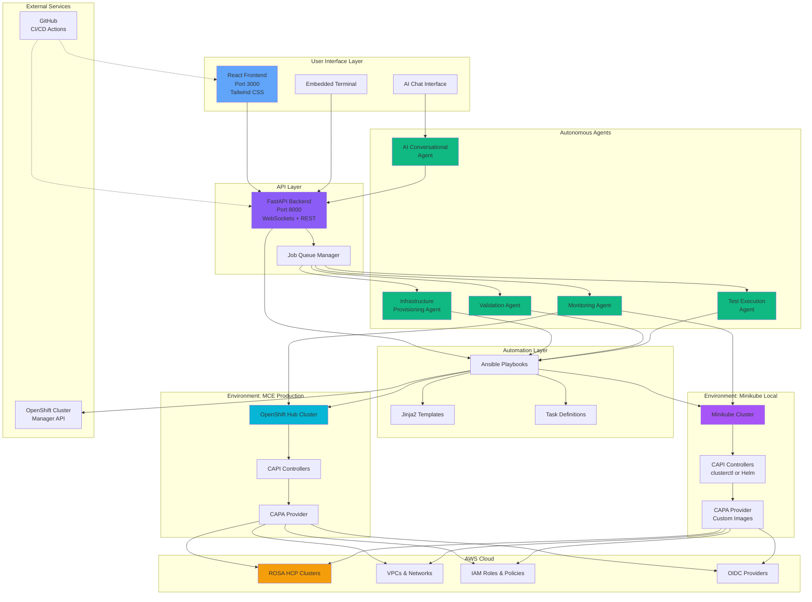

# CAPI Automation Architecture

## System Overview



## Component Details

### User Interface Layer

**React Frontend (Port 3000)**
- Modern React 18 with hooks
- Tailwind CSS with dual themes (MCE: cyan, Minikube: purple)
- Real-time updates via WebSockets
- Customizable workspace layout with drag-and-drop sections
- Storage cabinet for hiding/showing widgets

**Key Components:**
- `EnvironmentCard` - MCE vs Minikube environment selection
- `StatusCard` - Component and resource status display
- `ComponentStatusCard` - CAPI/CAPA component versions
- `ProvisionModal` - Cluster provisioning workflow
- `MinikubeTerminalModal` - Embedded terminal
- `CapiInstallMethodModal` - Installation method selection

### API Layer

**FastAPI Backend (Port 8000)**
- Async/await pattern for high performance
- REST endpoints for CRUD operations
- WebSocket connections for real-time updates
- Job queue management for long-running operations
- Pydantic models for request/response validation

**Key Endpoints:**
- `/api/mce/*` - MCE environment operations
- `/api/minikube/*` - Minikube environment operations
- `/api/capi/*` - CAPI component management
- `/api/provision/*` - Cluster provisioning
- `/ws/*` - WebSocket connections for real-time updates

### Autonomous Agents

**Infrastructure Provisioning Agent**
- Auto-generates AWS network stacks (VPCs, subnets, NAT gateways)
- Creates IAM account and operator roles
- Sets up OIDC providers
- Tags and links resources correctly
- Orchestrates 15+ AWS operations in the correct sequence

**Validation Agent**
- Real-time YAML syntax checking
- Version compatibility validation
- AWS region and instance type verification
- ROSA API validation for available versions
- Pre-deployment configuration checks

**Monitoring Agent**
- Polls cluster provisioning status
- Tracks Kubernetes resource states
- Detects stuck operations
- Surfaces errors proactively
- Sends email/Slack notifications

**AI Conversational Agent**
- Natural language question answering
- Context-aware responses (knows your cluster state)
- CAPI/ROSA knowledge base
- Error explanation and troubleshooting
- Best practice recommendations

**Test Execution Agent**
- Runs Ansible playbooks from UI
- Executes test suites across CAPI providers
- Parallel test execution
- Aggregates results and surfaces failures
- Streams output to Task Detail view

### Automation Layer

**Ansible Playbooks**
- `capi-assistant.yaml` - Interactive cluster management
- `end2end-test.yaml` - Full lifecycle testing
- `create_rosa_hcp_cluster.yaml` - ROSA provisioning
- `configure_environment.yaml` - Environment setup
- `verify_capi_environment.yaml` - Validation

**Jinja2 Templates**
- Located in `templates/versions/{version}/`
- Generate Cluster, ROSAControlPlane, ROSAMachinePool resources
- Feature-specific templates (network, roles, log forwarding)
- Version-specific configurations for ROSA 4.18, 4.19, 4.20, 4.21

**Task Definitions**
- Modular task files in `tasks/` directory
- Idempotent operations
- Comprehensive error handling
- Multi-environment support

### Environment: MCE Production

**OpenShift Hub Cluster**
- MultiCluster Engine (MCE) installed
- Manages production ROSA clusters
- Full CAPI/CAPA stack installed via Operator

**CAPI Controllers**
- Cluster API core controllers
- Handles Cluster, MachinePool resources
- Version managed by MCE

**CAPA Provider**
- AWS infrastructure provider
- Creates ROSAControlPlane, ROSANetwork, ROSAMachinePool
- Manages AWS resources via OCM API

### Environment: Minikube Local

**Minikube Cluster**
- Local Kubernetes for development/testing
- Runs on macOS/Linux/Windows
- Same provisioning workflow as production

**Installation Methods**
1. **clusterctl** - Standard CAPI installation CLI
2. **Helm Charts** - From stolostron/cluster-api-installer

**Custom CAPA Images**
- Reconfigure with pre-release features
- Point to custom image repositories (e.g., `quay.io/user/capa:pr-5786`)
- Apply updated CRDs from GitHub branches
- Test PRs before merging

### AWS Cloud

**ROSA HCP Clusters**
- Red Hat OpenShift Service on AWS with Hosted Control Planes
- Provisioned via CAPI/CAPA
- Managed lifecycle (create, update, delete)

**Network Infrastructure**
- VPCs with CIDR blocks (e.g., 10.0.0.0/16)
- Public and private subnets across availability zones
- NAT gateways, Internet gateways, route tables
- Auto-generated via ROSANetwork resource

**IAM Roles**
- Account roles (installer, support, worker, control-plane)
- Operator roles (ROSA-specific operators)
- OIDC identity providers
- Auto-generated via ROSARoleConfig resource

### External Services

**OpenShift Cluster Manager (OCM)**
- Red Hat's cluster management API
- Used for ROSA cluster creation/deletion
- Requires OCM client ID and secret
- Validates ROSA versions and configurations

**GitHub Actions CI/CD**
- Automated testing (pytest, Jest)
- Code quality (ESLint, Prettier, Black, Pylint, mypy)
- Security scanning (Trivy, TruffleHog)
- PR automation (semantic titles, size checks)
- Build verification

## Data Flow Examples

### Example 1: Provision ROSA Cluster (MCE Environment)

```
User clicks "Provision" in UI
    ↓
UI sends request to API (/api/provision/rosa)
    ↓
API creates job and assigns to Infrastructure Provisioning Agent
    ↓
Agent orchestrates workflow:
    1. Validation Agent checks YAML config
    2. Generates ROSANetwork, ROSARoleConfig, ROSAControlPlane YAML
    3. Applies YAML to MCE cluster via kubectl
    ↓
MCE CAPI controllers process resources:
    - ROSANetwork → Creates VPC, subnets in AWS
    - ROSARoleConfig → Creates IAM roles via OCM
    - ROSAControlPlane → Creates ROSA cluster via OCM
    ↓
Monitoring Agent polls cluster status every 30s
    ↓
Updates UI via WebSocket with progress
    ↓
Sends notification when cluster is Ready
```

### Example 2: Reconfigure Minikube with Custom CAPA Image

```
User clicks "Reconfigure" on CAPI/CAPA component
    ↓
UI shows CapiInstallMethodModal with custom image fields
    ↓
User enters:
    - Image: quay.io/contributor/capa:pr-5786
    - CRD URL: https://github.com/user/capa/tree/branch/api/v1beta2
    ↓
API receives reconfiguration request
    ↓
Infrastructure Provisioning Agent executes:
    1. Downloads CRDs from GitHub URL
    2. Applies updated CRDs to Minikube cluster
    3. Patches CAPA controller deployment with custom image
    4. Waits for rollout to complete
    5. Verifies new image is running
    ↓
Monitoring Agent confirms reconfiguration success
    ↓
UI refreshes component versions
```

### Example 3: AI Agent Troubleshooting

```
User types in chat: "Why is my cluster stuck at provisioning?"
    ↓
UI sends message to AI Agent via API
    ↓
AI Agent analyzes:
    1. Fetches cluster status from MCE/Minikube
    2. Checks ROSAControlPlane conditions
    3. Reviews ROSANetwork status
    4. Examines recent events/logs
    ↓
AI Agent responds with context:
    "Your cluster 'my-test' has been at 4% for 12 minutes.
     The ROSANetwork is creating VPC in us-west-2.
     This typically takes 8-15 minutes. Everything looks normal."
    ↓
User can ask follow-up questions in natural language
```

## Technology Stack

### Frontend
- React 18 (functional components, hooks)
- Tailwind CSS (utility-first styling)
- Heroicons (icons)
- Axios (HTTP client)
- Socket.io (WebSockets)
- React Flow (diagram visualization)

### Backend
- Python 3.9+
- FastAPI (async web framework)
- Pydantic (data validation)
- WebSockets (real-time communication)
- Uvicorn (ASGI server)

### Automation
- Ansible 2.9+
- Jinja2 (templating)
- YAML (configuration)

### Infrastructure
- Kubernetes 1.24+
- Cluster API v1beta1
- CAPA v1beta2
- OpenShift 4.12+
- Minikube

### Cloud & Services
- AWS (VPC, IAM, EC2)
- Red Hat OpenShift (ROSA)
- OCM API
- GitHub Actions

## Security Architecture

### Credential Management
- User credentials stored in `vars/user_vars.yml` (gitignored)
- Environment variables for CI/CD
- Kubernetes secrets for cluster credentials
- AWS credentials via AWS CLI configuration
- OCM tokens for API access

### Network Security
- Frontend served on localhost:3000 (dev) or reverse proxy (prod)
- Backend API on localhost:8000 with CORS protection
- WebSocket connections authenticated
- TLS/SSL in production deployments

### Code Security
- GitHub Actions security scanning (Trivy, TruffleHog)
- No hardcoded credentials
- Input validation via Pydantic models
- ESLint security rules enabled

## Deployment Options

### Development (Local)
```bash
# Terminal 1: Backend
cd ui/backend && uvicorn main:app --reload --port 8000

# Terminal 2: Frontend
cd ui/frontend && npm start
```

### Docker Compose (Recommended)
```bash
cd ui && docker-compose up
```

### Production (Kubernetes)
```bash
# Build images
docker build -t capi-automation-frontend:latest ui/frontend
docker build -t capi-automation-backend:latest ui/backend

# Deploy to Kubernetes
kubectl apply -f k8s/
```

## Monitoring & Observability

### Built-in Monitoring
- Task Summary widget (at-a-glance operation status)
- Task Detail widget (complete operation logs)
- Component status cards (CAPI/CAPA health)
- Resource counts by namespace

### Custom Notifications
- Email alerts (SMTP configuration)
- Slack webhooks
- Configurable triggers (job started, completed, failed)

### Logs
- Backend: Uvicorn access logs, FastAPI application logs
- Frontend: Browser console logs
- Ansible: Playbook execution logs with `-v` verbosity

## Scalability Considerations

### Horizontal Scaling
- Frontend: Static files served via CDN
- Backend: Multiple API server instances behind load balancer
- Job queue: Distributed task queue (Celery/Redis)

### Performance Optimization
- Async operations for I/O-bound tasks
- WebSocket connection pooling
- Efficient state management (React Context)
- Lazy loading for large components
- Bundle splitting and code optimization

### Resource Limits
- Frontend: ~50MB bundle size
- Backend: ~100MB Docker image
- Minikube: 2 CPU, 4GB RAM minimum
- MCE: Managed by OpenShift cluster resources

---

**Last Updated**: 2026-01-05
**Version**: 1.0
**Maintained By**: CAPI Automation Team
